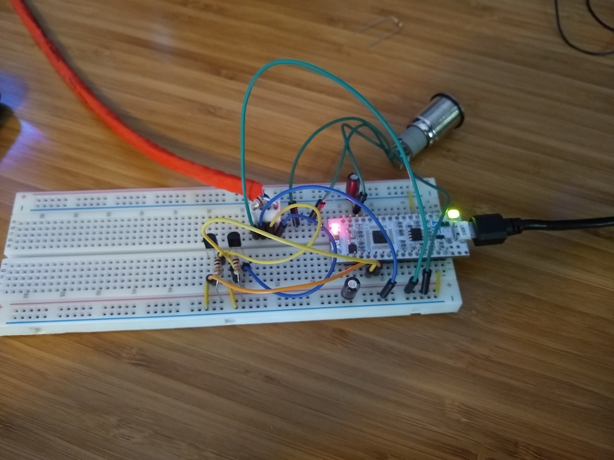
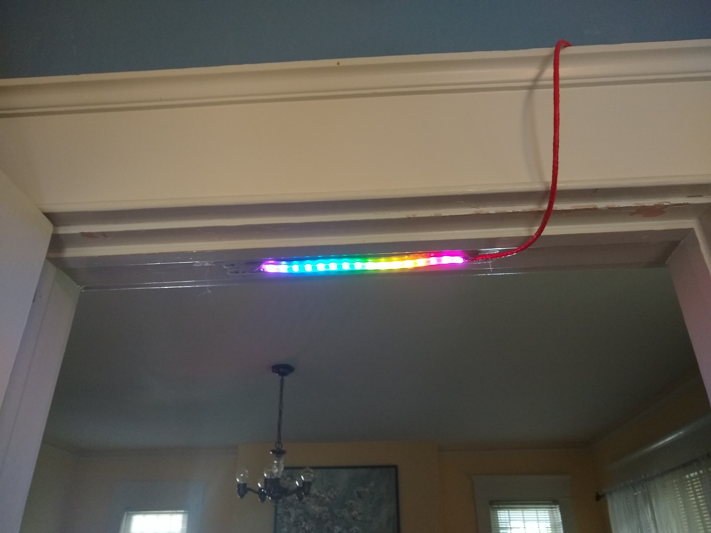

# Doorlight

A door-frame LED that lets others in your household know if you are busy or looking to party written in rust.

The program has three modes that are switched using a push button:
- Off: All leds are off
- Busy: All leds show a solid red light
- Party: All leds strobe through a rainbow pattern

